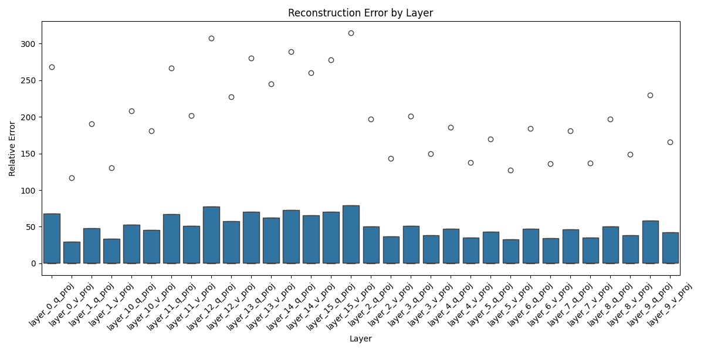
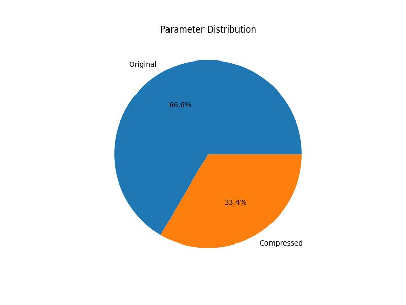

# SOPPU: Scalable One PEFT per User

SOPPU is a framework that enables efficient compression and serving of personalized LoRA adapters for Large Language Models. It combines client-side compression with scalable serving through LoRAX.

🎉 **Update**: Our paper has been accepted to DAI 2024 (International Conference on Distributed Artificial Intelligence)! Preprint will be available soon.

> ⚠️ **Note**: We are actively working on releasing the complete pipeline. Stay tuned for updates!

## Overview

SOPPU achieves:
- 1.99x compression ratio (1.7M to 856K parameters)
- 49.7% memory savings across adapters 
- Efficient serving of thousands of concurrent personal adapters

### Key Components

1. **Client-side Compression**
   - Compresses single or multiple LoRA adapters into one unified representation
   - Uses joint diagonalization for efficient compression
   - Preserves adapter functionality while reducing size

2. **Server-side Serving** 
   - Leverages LoRAX for dynamic adapter management
   - Efficient batching and memory optimization
   - Scalable inference serving

## Compression Analysis

Our evaluation demonstrates the effectiveness of adapter compression across different layers:

### Reconstruction Error Analysis

*Layer-wise reconstruction errors showing mean errors (blue bars) and individual samples (dots). Early layers show better preservation while query projections consistently show higher errors than value projections.*

Key findings:
- Early layers (0-5): 30-50 mean error range
- Middle layers (6-10): 40-60 mean error range
- Later layers (11-15): 60-80 mean error range
- Standard deviations approximately 1.7x the mean errors

### Memory and Parameter Distribution

*Distribution of parameters between original and compressed adapters showing 49.7% memory savings.*

## Architecture

### Client Side
- Adapter compression using joint diagonalization
- Local verification of compression quality
- Secure storage using safetensors

### Server Side
- Integration with LoRAX server
- Dynamic adapter loading/unloading
- Efficient batched inference
- Optimized GPU memory management

## Coming Soon
- Complete implementation with example usage
- Pre-trained adapter examples
- Integration guide with LoRAX
- Paper preprint

## Contact

- Yash Jain - yash012@e.ntu.edu.sg
- Mohor Banerjee - mohor001@e.ntu.edu.sg
